# vaultwarden-aws-tfs
Self contained installation of [Vaultwarden](https://github.com/dani-garcia/vaultwarden) in AWS using Terraform.

## Features
- HTTPS out from the box
- fail2ban - to minimize risk from bruteforcing credentials
- automatic backups - every day backup DB to S3 storage
- self maintained - include scripts to update server and restart to apply security patches
- self healed - used Autoscaling group to spin new instance in case of outage with restoring from last backup
- saving cost by using Spot instance

## Prerequisites
- AWS console account
- Route53 hosted zone
- EC2 key pair
- IAM user
- AWS CLI 2
- Terraform

## Preparation

#### AWS account
Because everything related to project will be handled in AWS cloud, you need to have an account.\
If you don't have one - please [Sign up](https://portal.aws.amazon.com/billing/signup).\
If you have - please [Sign in](https://aws.amazon.com/)

#### Route53 hosted zone
To have some human readable URL we should buy domain zone. 
- To do so, navigate to Route53 service 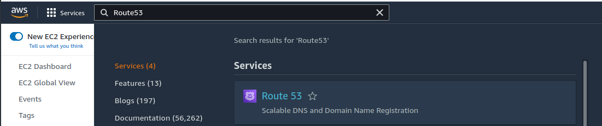
- then go to `Domain` under `Domain registration` 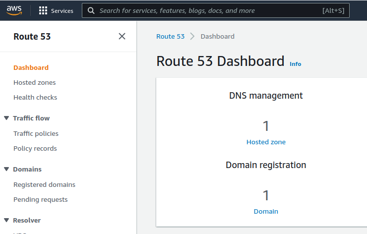 
- and then `Register Domain`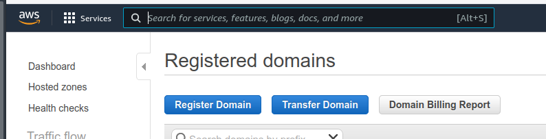
- you can choose different domain - each one has own cost. There is [list of all domain with pricing](https://d32ze2gidvkk54.cloudfront.net/Amazon_Route_53_Domain_Registration_Pricing_20140731.pdf)\
TL;DR; - `.link` is the cheapest one with 5$ to purchase.
- after you purchase a domain AWS will send you email with confirmation

#### EC2 key pair
- Please navigate [HERE](https://cloudpingtest.com/aws) and find `AWS Region Name` with lowest ping - remember its `Region Code`
- now let's proceed with creating key pair. Navigate to `Features Key pairs` 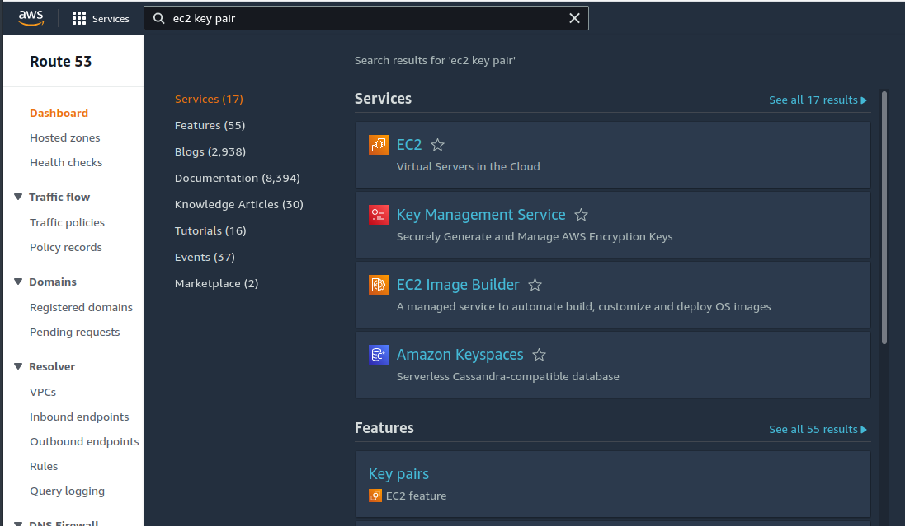
- then find dropdown in top-right corner 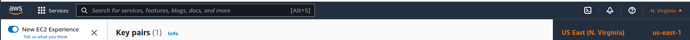 click on it and choose Region from previous step \
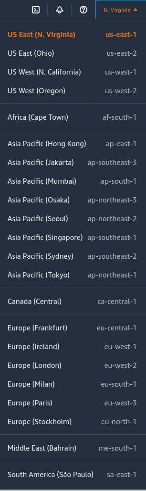
- click on `Create key pair`, give it some reasonable name, remember it and click `Create key pair`

#### IAM user
-  Navigate to `Features Users IAM service` 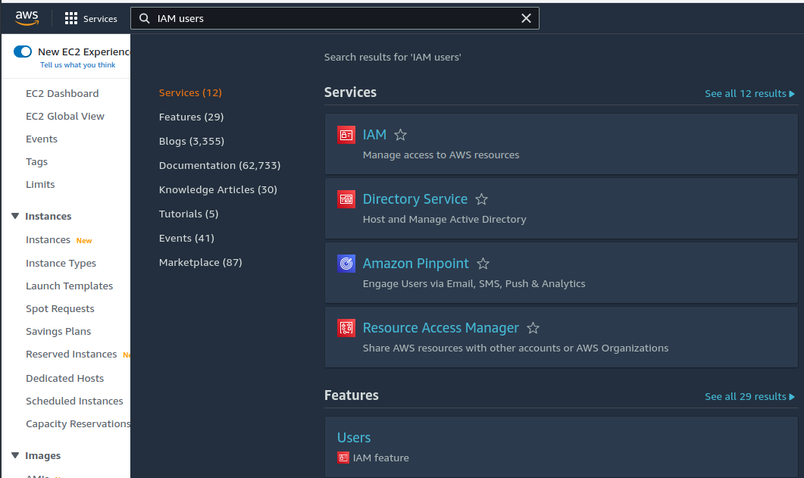 and click on `Add users`
-  Provide a user name (for example `terraform-user`) and choose Programmatic access 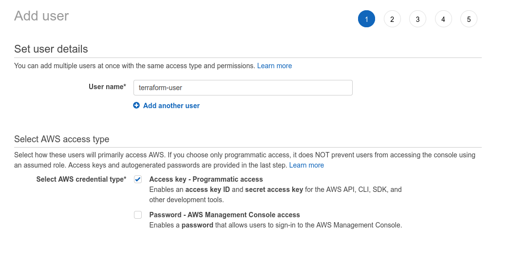 and click `Next: Permissions`
-  Choose `Attach existing policies directly` and enable `AdministatorAccess`  and click `Next: Tags`
-  Click on `Next: Review` and then on `Create user`
-  Please download .csv file with IAM user credentials and `Close` 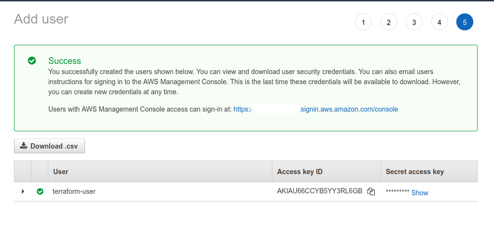

#### AWSCLI 2
- Please download and install [AWSCLI 2](https://docs.aws.amazon.com/cli/latest/userguide/getting-started-install.html). It will be used to configure access to your AWS account.
- After installation is done, please follow [Setup guide](https://docs.aws.amazon.com/cli/latest/userguide/getting-started-quickstart.html) and use `AWS Access Key ID` and `AWS Secret Access Key` grab from downloaded .csv file from IAM user stage.

#### Terraform
Please download and install [Terraform](https://www.terraform.io/downloads). It will be used to bootstrap whole infrastructure for a project.

## Usage
After project is cloned, copy `terraform.tfvars.example` and rename to `terraform.tfvars`
And populate it with configuration related to your setup. There is one restriction for `s3_bucket_name_prefix` - check it [HERE](https://docs.aws.amazon.com/awscloudtrail/latest/userguide/cloudtrail-s3-bucket-naming-requirements.html)
```
# choose Region code from EC2 key pair stage
region                = "" 
# region code with appended 'a'
aval_zone             = "" 
# domain which you bought in Route53 hosted zone stage
hosted_zone           = ""
# your prefix for URL 
domain_name_prefix    = ""
# email address which is used for request SSL certificate for HTTPS
email_for_cert        = "" 
# mark should be issued cert be test one or not. true or false
test_cert             = false 
# prefix to name S3 bucket to store backups and configutaion files
s3_bucket_name_prefix = "" 
# key pair name created on EC2 key pair stage
access_key_name       = "" 

```

Example of populated `terraform.tfvars`
```
region                = "us-east-1"
aval_zone             = "us-east-1a"
hosted_zone           = "example.org"
domain_name_prefix    = "vaultwarden"
email_for_cert        = "john.doe@mail.com"
test_cert             = false
s3_bucket_name_prefix = "vaultwarden-john-doe"
access_key_name       = "john-doe-key"

```
With current variables it will create URL `vautlwarden.example.org` with two S3 bucket `vaultwarden-backups-bucket` and `vaultwarden-configs-bucket` and will have proper SSL certificate for HTTPS.

After everything is configured run next commands
```
terraform init
terraform plan
```
If no error appeared run
```
terraform apply -f
```
to create infrastructure and bootstrap application. If it fails with error related to S3, just run this command again. After 15-20 minutes check your URL is Vaultwarden is up.
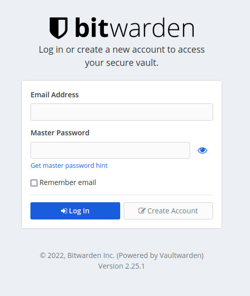

After you run installation and Terraform finished you will see two strings: 
- `full-domain-name` - URL for VaultWarden
- `admin-token` - secure code for admin dashboard - **NEVER** share it

## VaultWarden configuration
By default free registration is disabled and new users should be first invited from admin dashboard, and then they can proceed with registration.
To do so, go to `/admin` and enter your admin token.
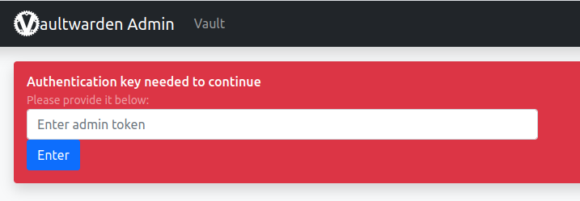

Go to `Users` tab and invite user by email. User **will not** recieve any notification. But you can go to main URL and proceed with registration process with invited email.

## Resources
Name|Type
---|---
aws_key_pair|data resource
aws_route53_zone|data resource
aws_autoscaling_group|resource
aws_default_route_table|resource
aws_eip|resource
aws_iam_instance_profile|resource
aws_iam_policy.eni|resource
aws_iam_policy.route53_dns|resource
aws_iam_policy.s3|resource
aws_iam_role|resource
aws_iam_role_policy_attachment.ec2_eni|resource
aws_iam_role_policy_attachment.ec2_route53_dns|resource
aws_iam_role_policy_attachment.ec2_s3|resource
aws_internet_gateway|resource
aws_launch_template|resource
aws_network_interface|resource
aws_route53_record|resource
aws_s3_bucket.backup|resource
aws_s3_bucket.config|resource
aws_s3_bucket_object.backup_script|resource
aws_s3_bucket_object.docker_compose|resource
aws_s3_bucket_object.maint-script|resource
aws_s3_bucket_object.nginx_301_filter|resource
aws_s3_bucket_object.nginx_301_jail|resource
aws_s3_bucket_object.nginx_400_filter|resource
aws_s3_bucket_object.nginx_400_jail|resource
aws_s3_bucket_object.nginx_404_filter|resource
aws_s3_bucket_object.nginx_404_jail|resource
aws_s3_bucket_object.nginx_bot_jail|resource
aws_s3_bucket_object.nginx_conf|resource
aws_s3_bucket_object.nginx_http_auth_jail|resource
aws_s3_bucket_object.notifier|resource
aws_s3_bucket_object.update_script|resource
aws_s3_bucket_object.warden_admin_filter|resource
aws_s3_bucket_object.warden_admin_jail|resource
aws_s3_bucket_object.warden_filter|resource
aws_s3_bucket_object.warden_jail|resource
aws_s3_bucket_public_access_block.backup|resource
aws_s3_bucket_public_access_block.config|resource
aws_security_group.public_http|resource
aws_security_group.public_https|resource
aws_security_group.public_ssh|resource
aws_security_group.vpc_traffic|resource
aws_subnet|resource
aws_vpc|resource
random_string.admin-token|resource


## Inputs
Name|Description|Type|Default|Required
---|---|---|---|:---:
region|AWS region deploy to|string|us-east-1|no
aval_zone|AWS availability zone deploy to|string|us-east-1a|no
hosted_zone|AWS domain zone|string||yes
domain_name_prefix|Custom prefix for URL|string|warden|no
email_for_cert|Email to notify for SSL cert EOF|string||yes
test_cert|Should request temp certificate for testing|boolean|false|yes
s3_bucket_name_prefix|Prefix for created S3 buckets|string||yes
access_key_name|Access key to configure SSH access to EC2 instance|string||yes

## Outputs
Name|Description
---|---
admin-token|Token used to acccess admin dashboard
full-domain-name|URL to access VaultWarden 

## License
This project is licensed under the terms of the MIT license.
